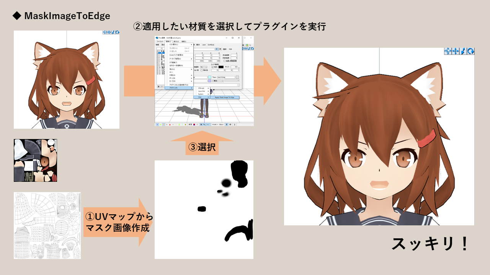

# Transfer Image Mask To Edge
* UV座標とグレースケールの画像から、マスクする感覚でエッジの倍率を適用するPMXEプラグインです。
* UV画像をコピペして、エッジを**消したいところを黒く**、エッジを**残したいところを白く**塗って、このプラグインに食わせると、その画像から適当に輝度を計算して一括でエッジ倍率を設定します。
* このとき作成したマスク画像は、Unity(UTS2)のOutlineSamplerにも転用できます。(逆も然り)

 

# 使い方
1. zipを解凍して、`MaskImageToEdge.dll`を右クリックし、メニューからプロパティを選択
2. 全般タブの末尾に、セキュリティのプロパティが表示されている場合は、「許可する(K)」にチェック
3. PMXEの`_plugin\User`下にdllを移動し、PMXEを起動
4. 編集->プラグイン->User->`Transfer Image Mask To Edge`を選択
5. 開いたファイル選択窓でマスク用の画像を選択

# その他
* 既にpmxモデルがある場合、実行前に同ディレクトリ下に`.bak`を付けたバックアップファイルを作成します。不要になったら消してください。

